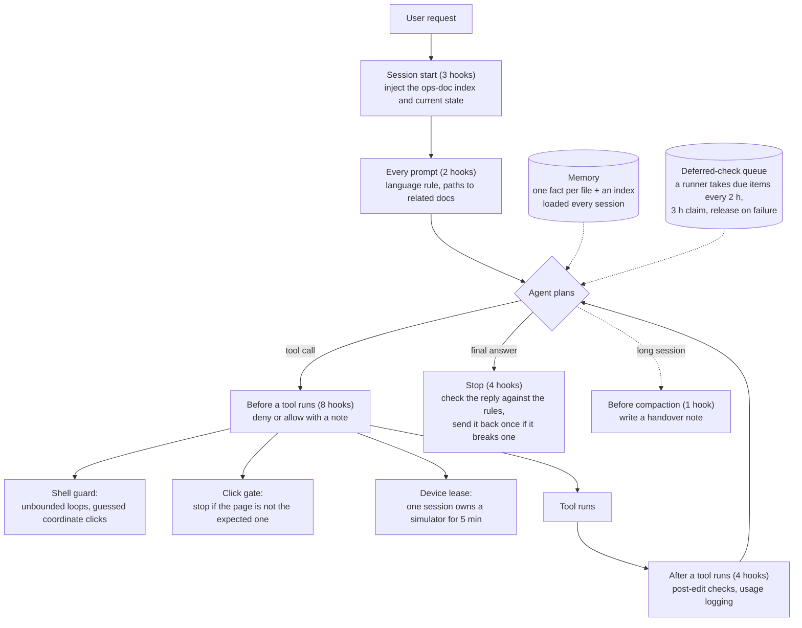

# agent-guardrails

Small, real pieces from the agent setup I run every day as the lead engineer of a short-term rental marketplace ([resume](https://sinabro-wooseok.github.io/)).
They are extracted from production use, with personal data and company-specific paths removed.

The theme is the same in both: **let the agent do the work, but put the boundaries in code, not in the prompt.**

## 1. `hooks/pre_bash_guard.py` — a guardrail hook for Claude Code

A `PreToolUse` hook that inspects every shell command before the agent runs it.

| Situation | Decision | Why |
|---|---|---|
| Background `until`/`while` wait loop with no exit condition | **deny** | A background command keeps running after the turn ends. An unbounded loop never finishes and keeps the session alive forever. A loop with `timeout N`, `$SECONDS` or a counter comparison is allowed. |
| Coordinate clicks from the shell (`cliclick`, `adb shell input`, `osascript ... click`) | **deny** | They make the agent guess screen coordinates. The agent has to use accessibility-tree tools (browser DevTools, mobile MCP) that let it *see* what it clicks. |
| `push` | allow + note | Reminds the agent to check for debug output and credentials first. |
| Long-running commands outside tmux | allow + note | Suggests tmux. |

Only command positions are matched (line start, after `;`, `&`, `|` or a wrapper such as `sudo`/`timeout`), so `grep -rn "cliclick" docs/` is not a false positive. That bug happened in real use and is now covered by a test.

```bash
python3 -m unittest hooks/test_pre_bash_guard.py
```

Register it in `~/.claude/settings.json`:

```json
{ "hooks": { "PreToolUse": [ { "matcher": "Bash",
  "hooks": [ { "type": "command", "command": "python3 /path/to/hooks/pre_bash_guard.py" } ] } ] } }
```

Messages to the agent are in Korean, because that is the language I work in.

## 2. `mail-triage/triage_unseen.js` — input stage of a mail-triage agent

A scheduled agent reads my inbox twice a day, summarizes it with deadlines and security alerts first, and sends me a one-line push notification. This script is the deterministic part that feeds it:

- It checks **every** mailbox with unread mail, not only the inbox. Billing and promotion folders were being missed, so the scope is now everything except Sent, Drafts, Junk and Trash.
- It strips every URL to `[링크]` ("link") before the text reaches the model, so the agent cannot be tricked into following links in emails. Instructions inside emails are treated as data.
- HTML-only mail (payment receipts, hosting reports) has no text part, so the body was empty and the agent saw only the subject. It now falls back to the HTML with tags stripped.
- It marks mail as read only after printing, and `--peek` gives a read-only dry run.

```bash
cd mail-triage && npm install && cp .env.example .env   # fill in IMAP credentials
node triage_unseen.js --peek
```

## How the whole setup is wired

The two pieces above sit inside a larger runtime. Rules that live only in the prompt get forgotten, so each rule is enforced at one of these points instead.



- Irreversible actions (delete, customer messages, payments, force push) need a human approval in chat.
- Feedback memories store the reason and when to apply it, not only the rule, so a rule does not spread past the situation it came from.
- "Check this again in a few days" goes into the queue instead of a new scheduled job per task.

## Design notes

- Deterministic code collects and sanitizes. The model only summarizes and ranks. Actions with side effects (sending, deleting, paying) go through a human approval step.
- Every guard comes from a real incident, and the incident is noted in the code comments.
